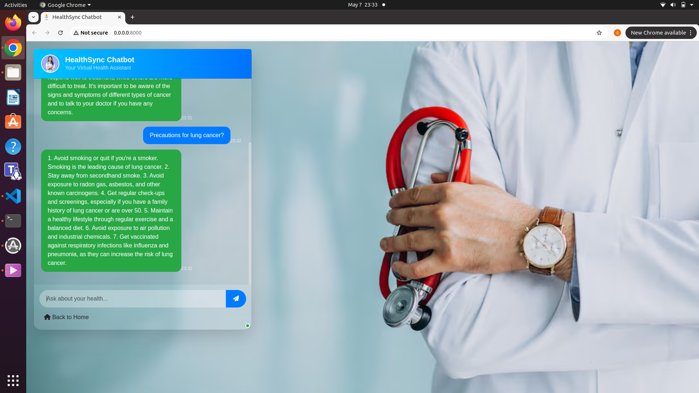

# 🩺 End-to-End HealthSync Chatbot Using Mistral LLM, Docker, and CI/CD

---

## 📸 UI Screenshots

Below are the key UI components of the HealthSync Chatbot app:





## Project Overview

This project demonstrates a full-stack deployment of a **MHealthSync Chatbot** powered by **Mistral's Large Language Model (LLM)**. It integrates **FastAPI** for backend API services, **LangChain** for LLM orchestration, **Pinecone** for efficient vector-based retrieval, and follows best practices for containerization and automation using **Docker** and **Jenkins CI/CD**.  
It is designed to deliver accurate, context-aware responses in medical query handling, and is optimized for scalable production deployment.

---

## ✨ Features

- HealthSync chatbot powered by **Mistral 7B** model
- **FastAPI** backend for lightweight, high-performance API
- **Vector Search** integration using **Pinecone**
- **LangChain** framework for LLM management and retrieval augmentation
- **Dockerized** for easy containerization and deployment
- **Automated CI/CD pipeline** using **Jenkins**
- **Environment-based configuration** with `.env` file
- **Scalable** for production-ready cloud deployments (AWS EC2/ECR)

---

## 🚀 Tech Stack

| Category             | Tools/Frameworks            |
|----------------------|-----------------------------|
| Programming Language | Python 3                    |
| Backend Framework    | FastAPI                     |
| LLM                  | Mistral 7B (Huggingface Hub)|
| Retrieval Database   | Pinecone                    |
| LLM Orchestration    | LangChain                   |
| Containerization     | Docker                      |
| CI/CD                | Jenkins                     |
| Cloud (Optional)     | AWS EC2, ECR                |
| Version Control      | GitHub                      |
| Environment Handling | dotenv                      |

---

# Medical Chatbot

## 🛠️ Installation and Setup

1. **Create and configure the `.env` file**  
   Add your Hugging Face token, Pinecone API key, and other environment variables.

2. **Run locally with Docker**  
   ```bash
   docker build -t medical_chatbot:v1 .
   docker run --env-file .env -p 8000:8000 medical_chatbot:v1


3. **Access the application**
  Open your browser and go to:
```bash 
    http://localhost:8000
```

5. **Set up Jenkins for CI/CD**

  - Create a Jenkins pipeline using the provided Jenkinsfile.

  - Configure a GitHub webhook for automatic builds and deployments.

📂  **Project Structure**
```bash
├── app.py                # FastAPI application
├── Dockerfile            # Docker build instructions
├── Jenkinsfile           # Jenkins CI/CD pipeline script
├── requirements.txt      # Python dependencies
├── .env                  # Environment variables (local)
├── src/                  # Source folder
│   ├── prompt.py         # Prompt templates for LangChain
│   └── utils.py          # Helper functions for embedding and model download
├── templates/            # Jinja2 HTML templates
├── static/               # Static files (CSS, JS)
└── README.md             # Project documentation
```

📦  **Deployment**

  - Deployable easily on any cloud (AWS EC2, ECR, Azure VM).

  - CI/CD pipeline automates pulling, building, testing, and deploying the containerized app.

  - Suitable for production with minor adjustments like HTTPS and authentication.

📢  **Key Highlights**

  - Combines Generative AI with traditional retrieval for better medical Q&A systems.

  - Demonstrates best practices in MLOps, containerization, and real-world deployments.

  - Designed to be lightweight, fast, scalable, and secure.

🧑‍💻  **Author**

   [Sujit Kumar Sangramsingh](https://www.linkedin.com/in/roy98210/)

📜  **License**

  This project is licensed under the MIT License.

